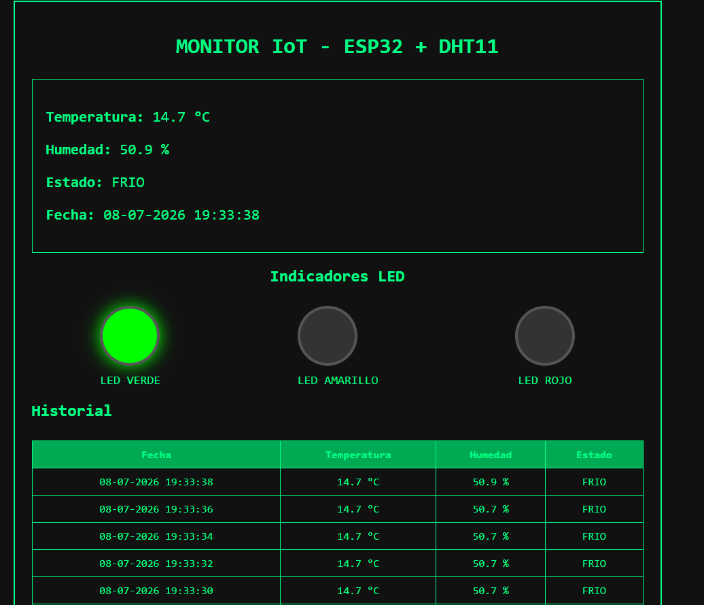
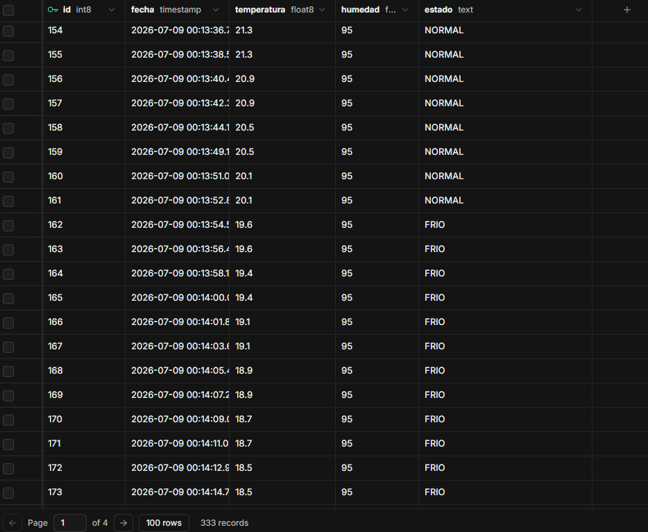
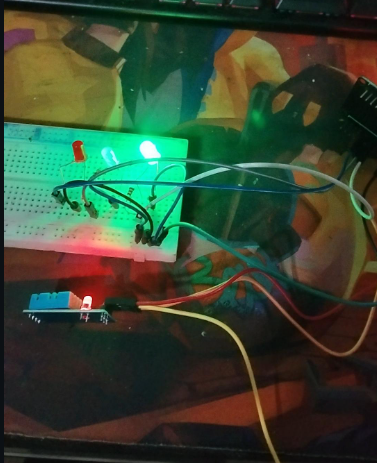

<div align="center">

# 🌡️ Sistema IoT de Monitoreo de Temperatura y Humedad

### ESP32 • DHT11 • Flask • Supabase • HTML • Python

Sistema IoT desarrollado para el monitoreo de temperatura y humedad utilizando una tarjeta ESP32, un sensor DHT11 y un servidor Flask encargado de recibir, visualizar y almacenar la información en Supabase.


</div>

---

# 📑 Índice

- Descripción
- Objetivos
- Arquitectura del sistema
- Hardware utilizado
- Software utilizado
- Funcionamiento
- Dashboard Web
- Base de datos Supabase
- Montaje del Hardware
- Comunicación
- Estructura del proyecto
- Instalación
- Ejecución
- Resultados
- Mejoras futuras
- Autor

---

# 📖 Descripción

Este proyecto consiste en el desarrollo de un sistema IoT capaz de monitorear temperatura y humedad utilizando un sensor DHT11 conectado a una tarjeta ESP32.

La información obtenida por el sensor es procesada por la ESP32, la cual activa distintos indicadores luminosos (LEDs) dependiendo del rango de temperatura detectado.

Posteriormente los datos son enviados mediante el protocolo HTTP hacia un servidor desarrollado en Flask.

El servidor recibe la información, la procesa, la almacena en una base de datos Supabase y la presenta en una interfaz web desarrollada en HTML.

---

# 🎯 Objetivos

## Objetivo General

Diseñar e implementar un sistema IoT capaz de adquirir variables ambientales, procesarlas y almacenarlas en la nube para su monitoreo en tiempo real.

## Objetivos Específicos

- Leer temperatura y humedad mediante un sensor DHT11.
- Procesar la información utilizando una ESP32.
- Activar indicadores LED según la temperatura.
- Enviar datos utilizando HTTP.
- Mostrar información en una interfaz web.
- Registrar todas las mediciones en Supabase.

---

# 🏗 Arquitectura del Sistema

```text
          DHT11
            │
            │
            ▼
         ESP32
            │
      HTTP (JSON)
            │
            ▼
      Servidor Flask
            │
            ▼
        Supabase
            │
            ▼
     Dashboard HTML
```

---

# 🔧 Hardware utilizado

- ESP32 Dev Module
- Sensor DHT11
- LED Verde
- LED Amarillo
- LED Rojo
- Resistencias 220 Ω
- Protoboard
- Cables Dupont
- Cable USB

---

# 💻 Software utilizado

- Arduino IDE
- Python 3
- Flask
- HTML5
- CSS3
- Supabase
- Debian 11
- VirtualBox
- GitHub

---

# ⚙ Funcionamiento del Sistema

Cada cinco segundos la ESP32 realiza una lectura del sensor DHT11.

Dependiendo del valor de temperatura obtenido, se activa un único LED representando el estado térmico del ambiente.

Posteriormente se genera un objeto JSON que es enviado mediante HTTP hacia Flask.

Flask recibe la información, actualiza el Dashboard y almacena el registro en Supabase.

---

# 🚦 Estados del Sistema

| Temperatura | Estado | LED |
|-------------|---------|-----|
| < 20°C | FRÍO | 🟢 Verde |
| 20°C - 30°C | NORMAL | 🟡 Amarillo |
| > 30°C | CALOR | 🔴 Rojo |

---

# 🖥 Dashboard Web

<p align="center">

</p>

**Figura 1.** Dashboard desarrollado en Flask donde se muestran las mediciones en tiempo real, el historial y el indicador visual del LED activo.

---

# ☁ Base de Datos Supabase

<p align="center">

</p>

**Figura 2.** Registro de todas las mediciones almacenadas en Supabase.

Cada registro contiene:

- Fecha
- Temperatura
- Humedad
- Estado

---

# 🔌 Montaje del Hardware

<p align="center">

</p>

**Figura 3.** Montaje del prototipo utilizando ESP32, sensor DHT11 y tres LEDs indicadores.

---

# 🌐 Comunicación

El sistema utiliza el protocolo HTTP para la transmisión de datos.

La ESP32 realiza una petición HTTP POST hacia Flask enviando un objeto JSON.

Ejemplo:

```json
{
    "temperatura":21.3,
    "humedad":95,
    "estado":"NORMAL"
}
```

---

# 📂 Estructura del Proyecto

```text
Proyecto_IoT/

│
├── app.py
├── templates/
│      └── index.html
│
├── images/
│      ├── dashboard.png
│      ├── hardware.jpg
│      └── supabase.png
│
├── esp32/
│      └── esp32_iot.ino
│
└── README.md
```

---

# 🚀 Instalación

## ESP32

- Abrir Arduino IDE.
- Configurar SSID y contraseña WiFi.
- Compilar.
- Cargar el programa en la ESP32.

---

## Flask

Instalar dependencias

```bash
pip install flask
pip install supabase
```

Ejecutar

```bash
python app.py
```

---

## Dashboard

Abrir el navegador

```
http://192.168.1.14:5000
```

---

# 📊 Resultados

El sistema logró:

- ✔ Lectura de temperatura.
- ✔ Lectura de humedad.
- ✔ Activación automática de LEDs.
- ✔ Comunicación HTTP.
- ✔ Dashboard Web.
- ✔ Registro en Supabase.
- ✔ Historial de mediciones.
- ✔ Monitoreo en tiempo real.

---

# 🔮 Mejoras futuras

- Incorporar autenticación de usuarios.
- Agregar gráficos históricos.
- Implementar MQTT como protocolo alternativo.
- Agregar notificaciones de alarma.
- Incorporar nuevos sensores ambientales.
- Visualización responsive para dispositivos móviles.

---

# 👨‍💻 Autor

**Mauricio Colil Figueroa**

Proyecto desarrollado como práctica de laboratorio para la asignatura de Internet de las Cosas (IoT).

Tecnologías utilizadas:

ESP32 · Python · Flask · HTML · CSS · Supabase · Arduino IDE